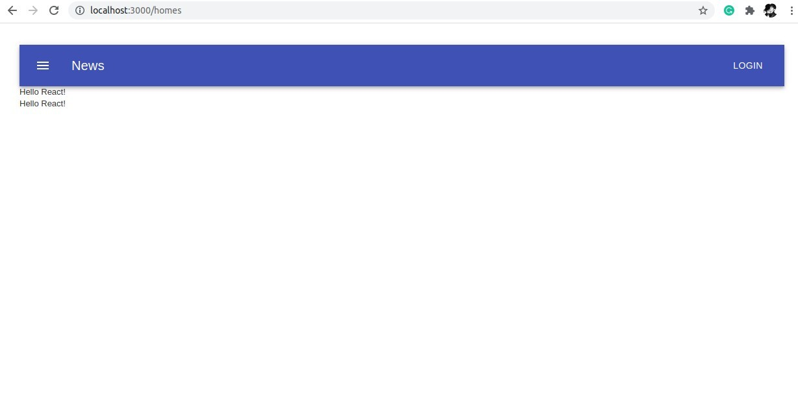

# README


----

Build project:

```
mv .env.development .env

docker-compose build
docker-compose up
```



Project infomation:

```
ruby: 2.6.8
rails: 6.1
```

GEM LIST

```
https://github.com/rails/webpacker#typescript
https://github.com/reactjs/react-rails
```


Config webpack react: 

```
rails webpacker:install:react
rails generate react:install
```


Install material: `npm install @material-ui/core @material-ui/icons --save`

Documents:

```
https://www.botreetechnologies.com/blog/how-to-add-material-ui-to-your-rails-react-app/
https://www.rubyguides.com/2020/03/rails-scaffolding/
https://github.com/mui-org/material-ui
```

----


